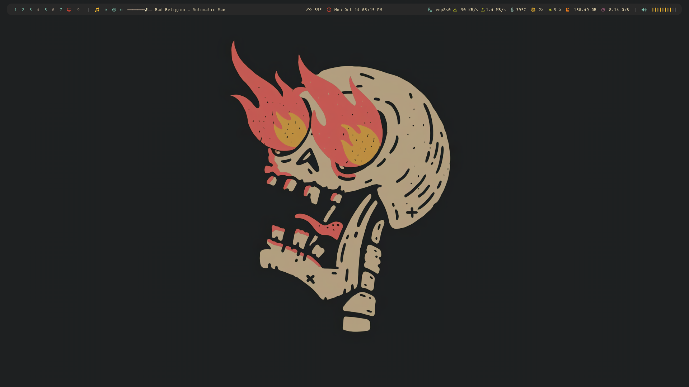
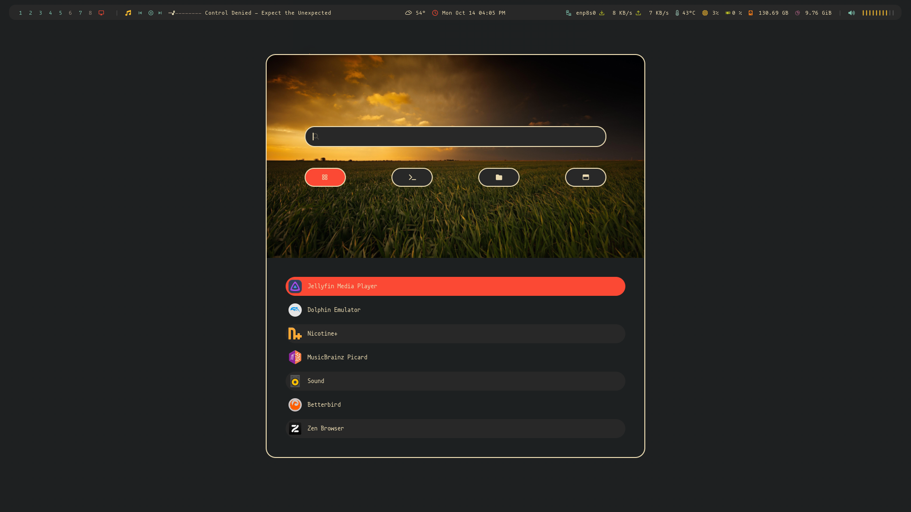
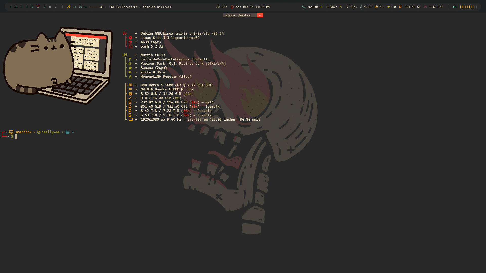
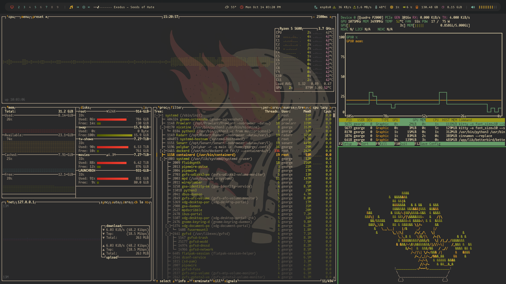
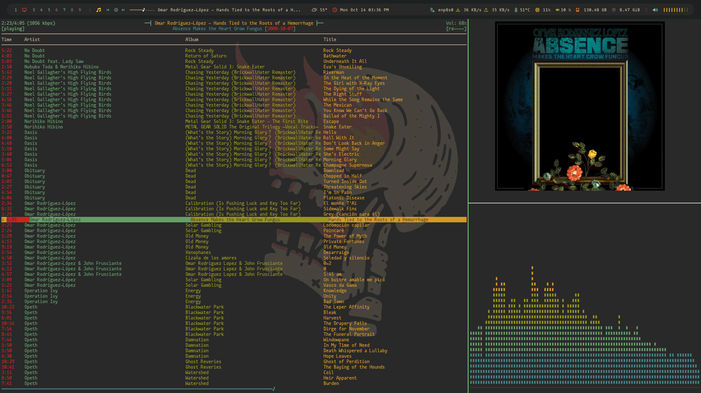
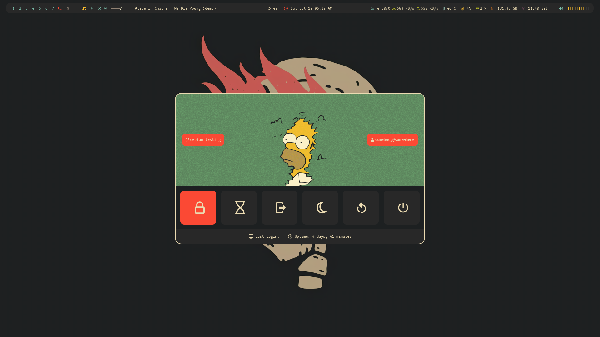

# .dotfiles

### ｡*ﾟ.*.｡(っ ᐛ )っ HELLO!!!

Behold, my dotfiles! They're meticulously crafted to make Debian-Testing more cromulent! 🎉

I hope these dotfiles serve as a source of inspiration for your own unique setup 🦄.

## Features

- a fancy ncmpcpp kitty session
- custom bash prompt
- custom fastfetch images to pick from
- subtle to heavy tweaks to polybar, rofi, kitty, and others
- gruvbox color scheme all over the place
- scripts to install deb repos, applications, configurations, and theming
- ffmpeg compiled with Nvidia/CUDA codecs and headers
- avisynth & vapoursynth
- native reaper daw install (config backup/upload planned, with more audio-related stuff coming soon)

## Screenshots

## More Info

I have switched from cinnamon to dwm. One day I'll try wayland again... thanks nvidia 🤷‍♂️ I'll incorporate my suckless dotfiles here too.

I like being able to do serious audio/visual work, gaming, browsing/streaming, or anything else from the same machine (assuming it has the power). This can makes things more bloated, but I try to keep things modular, when possible, for minimalist-focused setups. Things should only get better as I learn more and peck away at this repo.

There may be unexpected behaviors when you set it up on your hardware. You're not going to let that stop you though, right? With a little bit of tweaking, you can customize everything here to fit your own wants and needs. 🙌🎉✨

## To-Do List

Here's what I am putting off until I convice myself that it will be fun:

- [x] Add DRD Team Debian repo 💽
- [x] Add deb-multimedia.org repo 💽
- [x] Add more stuff that I use (tgpt, shell-color-scripts, plymouth, deb-get...) 📦
- [x] Add ricing stuff (Colloid-Red-Dark-Gruvbox, Bibata-Modern-Ice, Papirus-Dark) 🌈
- [x] Add even more stuff that I use (stylepak, gruvbox-papirus-folders, nwg-look...) 🎨
- [x] Add prompts at certain points in the script 🧐
- [ ] Add configs for Flatpak applications 🫙
- [ ] Add configs for System applications (lightdm, realtime audio stuff, etc...) 🏛️
